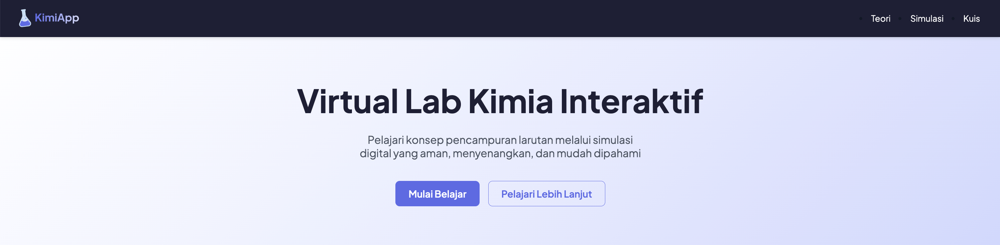

# II3140-G7-KimiApp

# KimiApp - Laboratorium Virtual Kimia ⚗️

KimiApp adalah platform pembelajaran kimia interaktif berbasis web yang dirancang untuk membantu siswa memahami konsep pencampuran larutan. Aplikasi ini menyediakan laboratorium virtual yang aman dan menarik, memungkinkan pengguna untuk bereksperimen dengan berbagai reaksi kimia secara digital.

  

---

## ✨ Fitur Utama

Proyek ini dibagi menjadi tiga modul utama untuk menciptakan pengalaman belajar yang menyeluruh:

* **Modul Teori:** Penjelasan mendalam tentang konsep dasar larutan (solute, solvent), jenis-jenis reaksi kimia (Asam-Basa, Redoks), dan tabel indikator pH interaktif.
* **Simulasi Interaktif:** Laboratorium virtual di mana pengguna dapat secara bebas mencampurkan berbagai larutan asam, basa, dan netral untuk mengamati perubahan warna secara *real-time*.
* **Kuis Akhir:** Uji pemahaman melalui serangkaian pertanyaan pilihan ganda dan skenario interaktif berdasarkan materi dari modul teori dan simulasi.

---

## 💻 Tech Stack

Teknologi yang digunakan untuk membangun proyek ini:

* **Struktur:** HTML5 Semantik
* **Styling:** CSS3 (dengan Variabel Kustom)
* **Interaktivitas:** JavaScript (Vanilla JS)

---

## Akses

Website bisa diakses di link berikut:
https://ii3140-g7-kimiapp-production-d462.up.railway.app/
